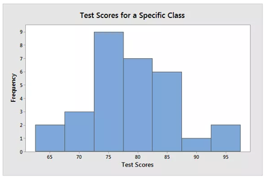
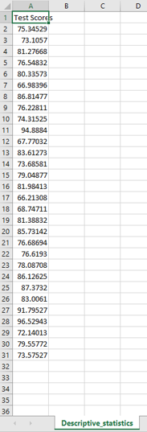
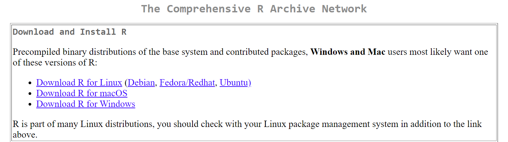
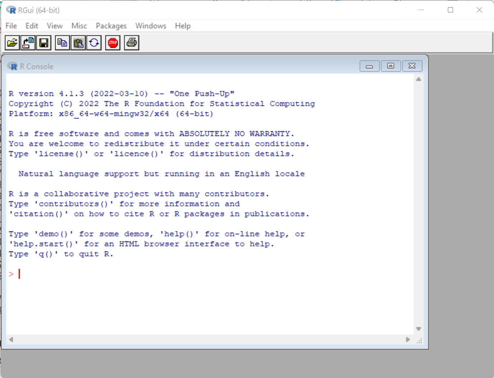
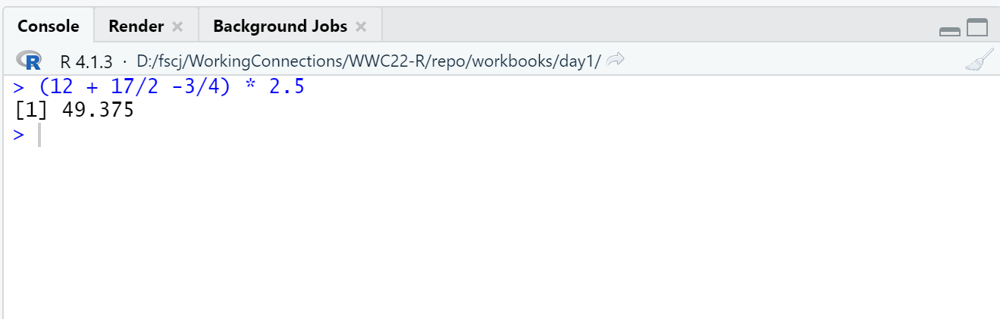

```{r rmarkdown-setup, echo = FALSE}
knitr::opts_chunk$set(warning = FALSE)
knitr::opts_chunk$set(message = FALSE)
```

### History of R

-   R is a dialect of S, a language that was developed by John Chambers
    and others at the old Bell Telephone Laboratories, originally part
    of AT&T Corp.
-   S was designed for interactive data analysis (more command-line
    based) as well as for writing longer programs (more traditional
    programming language-like).
-   One key limitation of the S language was that it was only available
    in a commercial package.
-   R was created by Ross Ihaka and Robert Gentleman in the Department
    of Statistics at the University of Auckland. In 1993 the first
    announcement of R was made to the public.
-   In 1995, Martin Mächler made an important contribution by convincing
    Ross and Robert to use the GNU General Public License to make R free
    software.
-   In 1996, a public mailing list was created (the R-help and R-devel
    lists) and in 1997 the R Core Group was formed, containing some
    people associated with S and S-PLUS. Currently, the core group
    controls the source code for R and is solely able to check in
    changes to the main R source tree. Finally, in 2000 R version 1.0.0
    was released to the public.

<https://bookdown.org/rdpeng/rprogdatascience/history-and-overview-of-r.html>

### What is Statistical Programming?


### Descriptive Statistics

-   Describe a sample
-   Summarize and graph group properties
-   Presented using numbers and graphs
-   No uncertainty, no inferences about larger populations
-   Common tools:
    -   mean/median - the center ("central tendency"); where most values
        occur
    -   range/standard deviation - how far from center does data extend
    -   skewness - whether a distribution is symmetric or skewed

### Example of Descriptive Statistics

-   Describe test scores of 30 students in a class






### Inferential Statistics

Makes inferences about larger populations using sample group

-   (Random) sample must accurately reflect population

Process can be complicated:

1.  Define population
2.  Draw representative sample from population
3.  Analyze and infer (sampling error must be considered)

Common tools:

-   hypothesis tests: two alternate theories, which is supported?
-   confidence intervals: range of likely values
-   regression analysis: validate observed relationships

### Example of Inferential Statistics

- Same test used for descriptive statistics example, but now we want to draw inferences about a population


<http://statisticsbyjim.com/basics/descriptive-inferential-statistics/>


### Why R?

- R is a sophisticated statistical programming language "tailored" for data science
- Free, open source
- Runs on any operating system
- Produces high quality graphics
- Diverse community
- <https://twitter.com/search?q=%23rstats>
- <https://meetup.com/topics/r-programming-language>
- <https://rweekly.org>
- <http://r-ladies.org>
- Huge inventory of packages for modelling, machine learning, visualization, data manipulation

### Why NOT R?

- Lack of elegant or well-maintained code base
- Result-focused, not process-focused
- Many R programmers do not reliably incorporate established software engineering practices (e.g. code control, automated testing)
- Some R functions are obscure and some are inconsistent or unreliable
- Contributed packages are inconsistent
- Poor performance (especially for poorly written code) and high memory usage

### The R Project

- CRAN (Comprehensive R Archive Network) 
- Download R program versions using CRAN mirrors at <http://www.r-project.org>

- Website contains: 
  - Documentation
  - Help
  - Additional packages of analytical routines


### Installing R

- Visit R Project website at <http://www.r-project.org>
- Click the download R link and select a mirror site
- Choose your Operating System and click the link.
- Follow the links for the appropriate version.
- Download the installation file to your computer.
- Run the installation file to install the program.
- Install Rtools if desired (build custom packages).



### Running R

- R can run directly on the command line or in a basic GUI (not RStudio)
- Type R on the command line (requires the correct PATH value) or use the desktop icon



# Getting Help

- There are manuals and documentation on the R website.
- R has extensive built-in help for commands
  - ?topic to invoke help on a topic brings up a local HTML file containing the help information

**?mean**


---

### Try it yourself! Get help for the cat function by typing in the box provided below by typing **?cat**

```{r}

```

### Anatomy of an R Help Entry

- Similar to unix manual ("man") pages
- Top shows command name and description
- Middle shows common usage and instructions/parameters
- Bottom shows references and examples


### Packages

- The R program is split into packages.
- A package is a collection of functions, data, and compiled code
- The standard installation contains various packages.
- Additional packages of analytical routines and utilities can be downloaded from the R website.
- To see **currently installed and loaded** packages, type **search()**

### Try it!
```{r}

```

- To list **all downloaded** packages, type **installed.packages()**

### Try it!
```{r}

```

### Typing in the R Console Window

- The console is available directly from the command line, in the bundled R GUI, and in RStudio (bottom left pane)
- The > symbol shows where to type into R console window
- Commands can spread over more than one line
- If the cursor displays a + then some additional typing is required (usually a closing parenthesis)
- Spaces are usually ignored
- R can work like a simple calculator. type the expression into the R console and results are displayed immediately
- Remember standard order of calculation: division and multiplication are evaluated before subtraction and addition
- Use parentheses to ensure correct evaluation order

### R GUI Console

### RStudio Console


### Try it!
### Type (12 + 17/2 - 3/4) * 2.5

```{r}

```

### R Objects and Assignment

- R works on named objects ("everything is an object"), also known as variables
- A calculation is assigned to a name to create or overwrite the named object
- The R assignment operator is **<-** !! (more on this later)
- If a variable name is specified the result is not shown:
  - ans1 <- 23 + 14/2 - 18 + (7 * pi/2)
  - ans2 <- 13 + 11 + (17 - 4/7)
  - ans3 <- ans2 + 9 - 2 + pi
- You can type the object name to see the result:
  - ans1
  - [1] 22.99557

### Try it!
### Type the assignment statements shown above, then type one or more of the variable names on the next line

```{r}

```

Objects can be assigned using a left-pointing arrow \<-

  - ans4 <- 3 + 5
  - ans5 <- ans1 * ans2
- The equal sign = also assigns a value, but is not preferred (it is normally used only for named arguments in function calls -- covered later)
  - ans3 = ans2 + 9 - 2 + pi
  
  <https://renkun.me/2014/01/28/difference-between-assignment-operators-in-r/>

- The arrow can be reversed (but don't!)
  - ans3 + pi / ans4 -> ans6

