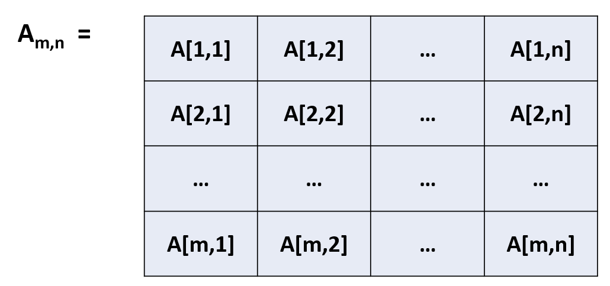

```{r rmarkdown-setup, echo = FALSE}
knitr::opts_chunk$set(warning = FALSE)
knitr::opts_chunk$set(message = FALSE)
```

## Day 1 Module 2

### Vectors

- A vector is a collection of primitive data types
  - It can consist of a single value
  - length() displays the length of the vector
  - The "is" functions can verify a data type

```{r}
# create vector of length 1
five <- 5
five
# notice that cat outputs a space after each argument
cat('length of five is', length(five), '\n')
cat('is five a vector? ', is.vector(five), '\n')
#
numbers <- c(1, 2, 3, 4, 5)
# show the length of numbers

#
letters <- c('a', 'b', 'c', 'd', 'e')
# show the length of letters

# remember that string data can also use double-quotes
words <- c("Welcome", "to", "R")
```

### Logical Data Types

- Logical vectors contain boolean TRUE and FALSE values
  - TRUE and FALSE can be abbreviated as T and F
  - the typeof() function displays the data type

```{r}
all_true <- c(T, T, T)
all_true
some_true <- c(TRUE, FALSE, TRUE)
some_true
typeof(some_true)
```

### Vector Functions

- In addition to the length() function, there are several other useful functions which are applied to vectors: seq, rep, and sort

  - seq generates regular sequences
  - rep replicates values
  - sort sorts a vector in ascending or descending order
  - length can get **or set** the length of a vector

### The seq() function

- We can create sequences without a function, but seq() provides more flexibility

```{r}
# create a vector with values from 3 to 27
vals <- 3:27
vals

# extend it a bit
newvals <- c(vals,28,29,30)
newvals

# use seq() to create a vector
# create a sequence from 3 to 27, increment by 3
seq(from = 3, to = 27, by = 3)

# same function, but without named arguments
seq(3, 27, 3)

# adjust the from and to arguments to go backwards
#seq(3, 27, -3)     # can't step backwards from 3 to 27!

seq(27, 3, -3)     # fixed it

# Use length.out argument instead of by to 
# specify how many values in the sequence
# (40 means the data will include fractional values)

seq(from = 3, to = 27, length.out = 40)
```

### Try it! Create a vector from 0 to 100 which counts by 10s

```{r}

```

### The rep() Function

- rep() is used to replicate (repeat) a value, which can be a vector

```{r}
rep(x=1,times=4)
```

- the **times** parameter specifies the number of times to repeat each element

```{r}
rep(x=c(3,62,8.3), times=3)
```

- the **each** parameter tells rep() to replicate each element of a vector **and** repeats the vector

```{r}
rep(x=c(3,62,8.3), times=3, each=2)
```

- As indicated by the name, sort() will sort vector values
  - direction is indicated by the decreasing argument

```{r}
sort(x=c(2.5,-1,-10,3.44),decreasing=FALSE)

sort(c(2.5,-1,-10,3.44),F) # F or FALSE works

sort(x=c(2.5,-1,-10,3.44),decreasing=TRUE)

# decreasing is FALSE by default
v <- sort(c(2.5,-1,-10,3.44)) 
v
```

### Subsetting Vectors and Element Extraction
- The square bracketed numbers in R console output correspond to the **index** of the element immediately adjacent (similar to an array element index, but note they are **1-based**, not 0-based)

> length(x=5:13)   # show length of (5, 6, 7, 8, 9, 10, 11, 12, 13)

**[1]** 9

> seq(from = 3, to = 27, length.out = 40)

**[1]**  3.000000  3.615385  4.230769  4.846154  5.461538  # 5 elements, next index is 6

**[6]**  6.076923  6.692308  7.307692  7.923077  8.538462  # 10 elements, next index is 11

**[11]**  9.153846  9.769231 10.384615 11.000000 11.615385

- Specific elements can be retrieved from vectors (and other data structures) using **subsetting**
  - Use the name of the vector followed by the index (position) in square brackets

```{r}
v <- c(10, 20, 30, 40)
v[1] 
v[4]

vs <- c("January", "February", "March", "April")
vs[1]      # first element
vs[3]      # third element

# the length function can be used to extract relative to vector length
vs[length(vs)]      # last element
vs[length(vs)-1]    # next to last element
```

- To emphasize: R vectors are **1-based**, not 0-based
  - 0-based arrays actually started with C language, other languages used that mechanism
  - Fortran (a scientific/engineering programming language) uses 1-based arrays
  - Most mathematics and statistical concepts use 1-based vectors (e.g. linear algebra)
  - R, as a statistician's language, follows the mathematician's approach
  - **There is no element 0**

```{r}
vs <- c("January", "February", "March", "April")
vs[1]
vs[0]  # nothing to see here!
```

- Negative indexes can be used to exclude elements
-   Compare this to Python, which uses negative values for "reverse" traversal

```{r}
vs <- c("January", "February", "March", "April")
vs
vs[-1]      # exclude first element
vs[-4]      # exclude last element
vs[-5]      # no 5th element to exclude
```

- Using square bracket notation to extract elements does not modify R vectors
  - We must assign results to a new vector to preserve changes, or reassign to the original to modify

```{r}
vs <- c("January", "February", "March", "April")
vs
vs[-3]                   # does not modify original
vs                       # still the same
newvs <- vs[-3]          # create new vector
newvs
oldvs <- vs              # save current one
vs <- vs[-2]             # overwrite original
vs
```

- Vectors can be used as indexes in order to select a subset of another vector

```{r}
v <- c(10, 20, 30, 40)
vs <- c("January", "February", "March", "April")
vs
vs[c(2,4)]     # select 2nd and 4th elements
v
v[c(3,4)]      # select 3rd and 4th elements
```

- Use the colon operator as an index sequence

```{r}
v <- c(10, 20, 30, 40)
vs <- c("January", "February", "March", "April")
v[1:3]     # select 1st through 3rd elements
vs[2:4]    # select 2nd through 4th elements
```

- The replicate function can be used to repeat an index

```{r}
vs <- c("January", "February", "March", "April")
# select index 2 three times
vs[c(rep(x=2,times=3),3,4)]
```

- Use a "negative vector" to exclude multiple items

```{r}
vs <- c("January", "February", "March", "April")
vs[-c(2,3)]   # exclude 2nd and 3rd elements
``` 

- We cannot mix negative/positive values inside a single vector to exclude and include simultaneously

```{r}
# can't exclude and include in same vector
# vs[c(-2,3)]    # Error -- uncomment to test
```

- Replacing individual values using indexes

```{r}
v <- c(10, 20, 30, 40)
vs <- c("January", "February", "March", "April")
v
v[1] <- 5    # replace first element
v
# replace 2nd, 3rd, and 4th elements
v[c(2,3,4)] <- c(10,15,20)
v
```

### Vector-Oriented Behavior

- We can use the vector-oriented behavior of R to perform operations on vectors more efficiently than other programming languages
  - Many languages would require a loop to complete these operations

```{r}
v <- c(10, 20, 30, 40)
v
v+c(10,20,30,40)  # element-by-element addition
v * c(2,2,2,2)    # double each element
```

- **recycling** refers to R's behavior when operating with two different sized vectors

```{r}
1:6 + 1:3
```

- R "recycles" or repeats the shorter vector to match the length of the longer
If the longer item is not a multiple of the shorter a warning is displayed

```{r}
1:5 + 1:3
```

- Compare the use of recycling to double a vector's elements vs. the element-by-element operation

```{r}
v <- c(5, 10, 15, 20)
v * c(2,2,2,2)    # element-by-element

# same result, much simpler using recycling
v * c(2)
```

## Matrices and Arrays

- A **matrix** in R is an two-dimensional object typically described as m x n (m rows by n columns)
  - the data types must be the same (no mixing)
  - the size is m * n (m times n)
  - each element is referenced by two values – row and column



- A matrix is created in R using the **matrix()** function
  - e.g. to create a 2 x 2 matrix:

```{r}
A <- matrix(data=c(-3,2,893,0.17),nrow=2,ncol=2)
A
```

- If the dimensions are left out, R defaults to a single column (ncol = 1)

```{r}
A <- matrix(data=c(-3,2,893,0.17))
A
```

- If the dimensions are specified, the data vector **must provide the appropriate number of elements**
  - Otherwise the data values will be recycled

```{r}
# create matrix with missing element
A <- matrix(data=c(-3,2,893),nrow=2,ncol=2)
A
```

- R fills matrices in column-wise, or column-major, order by default
  - the **byrow** argument controls this, which is FALSE by default

```{r}
# fill column 1, then column 2, then column 3
m <- matrix(data=c(10, 20, 30, 100, 200, 300),nrow=2,ncol=3)
m
#
# same thing with byrow=F (the default)
m <- matrix(data=c(10, 20, 30, 100, 200, 300),nrow=2,ncol=3, byrow=F)
m
#
# now switch it up with byrow=T
#
m <- matrix(data=c(10, 20, 30, 100, 200, 300),nrow=2,ncol=3, byrow=T)
m
```

