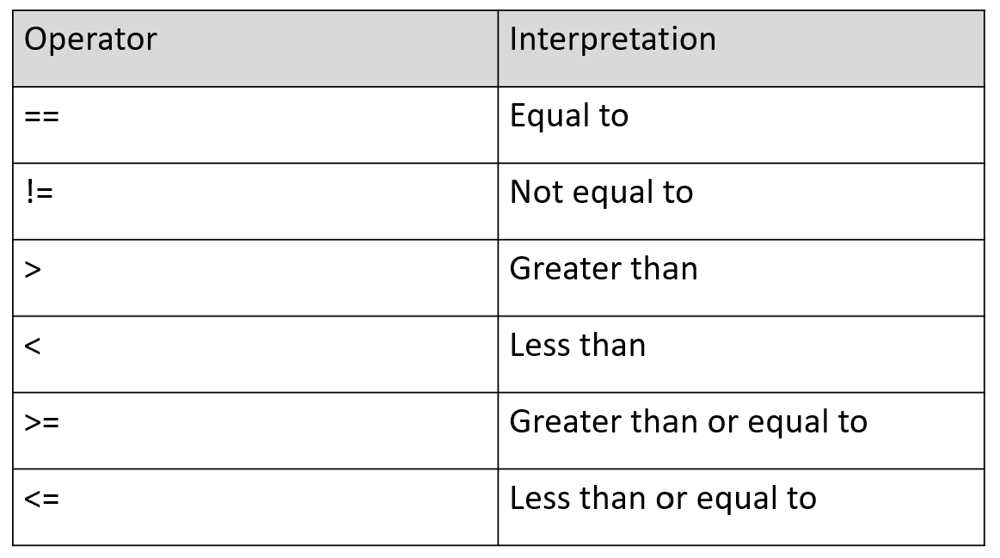

```{r rmarkdown-setup, echo = FALSE}
knitr::opts_chunk$set(warning = FALSE)
knitr::opts_chunk$set(message = FALSE)
```

## Day 1 Module 3

## Extended Data Types and Data Structures

### Non-Numeric Values

- Logical values are TRUE and FALSE (or T and F)
  - Logical values can be assigned to objects such as vectors and matrices

```{r}
x <- T
x

y <- FALSE
y

v <- c(T,T,F,F)
v
```

### Relational Expressions

- Relational expressions produce logical values using relational operators




