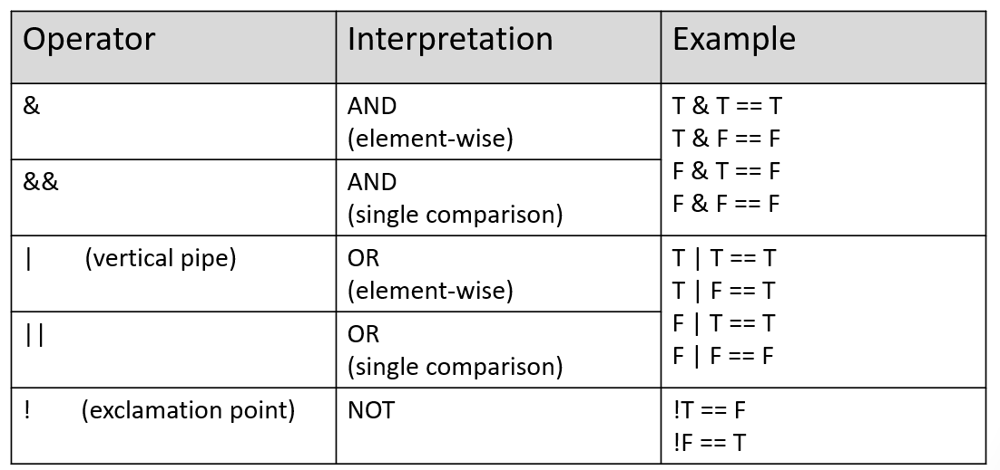
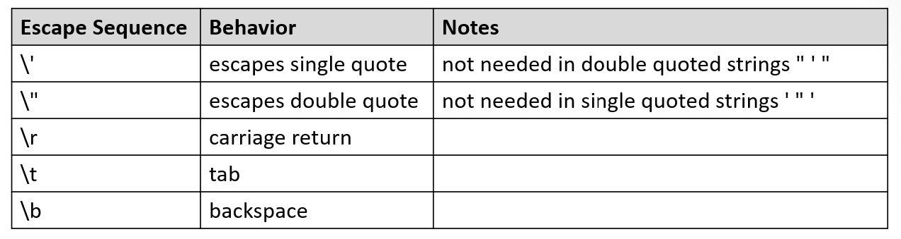

```{r rmarkdown-setup, echo = FALSE}
knitr::opts_chunk$set(warning = FALSE)
knitr::opts_chunk$set(message = FALSE)
```

## Day 1 Module 3

## Extended Data Types and Data Structures

### Non-Numeric Values

- Logical values are TRUE and FALSE (or T and F)
  - Logical values can be assigned to objects such as vectors and matrices

```{r}
x <- T
x

y <- FALSE
y

v <- c(T,T,F,F)
v
```

### Relational Expressions

- Relational expressions produce logical values using relational operators


### Relational Operator Examples

```{r}
1 == 2
1 > 2
1 < 2
1 != 2

x <- 10
y <- 20
x == y
x < y
x > y
x != y
```

### Relational Operators with Vectors

- R does an element by element comparison when a relation operator is applied

```{r}
v1 <- c(1,2,3,4)
v2 <- c(2,2,3,4)
v1 == v2

v1 != v2

v1 < v2

v1 > v2
```

- Recycling works with relational operators

```{r}
v1 <- c(1,2,3,4)
v1

z <- c(2,3)
z

# compare 1,2,3,4 to (recycled) 2,3,2,3
v1 < z
```

### Relational Operators with Matrices

- Relational operators compare column-by-column

```{r}
m1 <- matrix(data=1:8,nrow=4)

m1
z1 <- c(2,3,4,5)
m1 < z1   # compare column by column to z1
```

### Logical Operators

- Logical operators are useful for combining multiple relational expressions

  - The result of any logical operator is a logical value of TRUE or FALSE
  - R is unique in that it provides both single comparison logical AND and OR operators and element-wise AND and OR operator



### Logical Operators: Long vs Short AND

- '&' is element-wise ("long")

```{r}
x1 <- c(T, F, T, F)
x2 <- c(T, T, T, T)
x1 & x2
```

- '&&' is single comparison, compares first vector elements **only** ("short")

```{r}
x1 && x2
x3 <- c(F, F, F, F)
x1 && x2 && x3
```

### Logical Operators: Long vs Short OR

- '|' is element-wise ("long")

```{r}
x1 <- c(T, F, T, F)
x2 <- c(T, T, T, T)
x1 | x2
```

- '||' is single comparison, compares first vector elements only ("short")

```{r}
x1 || x2
x3 <- c(F, F, F, F)
x1 || x2 || x3
```

### Logical Operators: NOT

- The logical NOT operator inverts the value of a logical expression

```{r}
x1 && x2 && x3
!(x1 && x2 && x3)
x1 || x2 || x3
!(x1 || x2 || x3)
```

### Logical Operators: Order of Precedence

- Logical AND operations have a higher precedence than OR
  - Use parentheses to change the order of evaluation

```{r}
v1 <- c(2,3)
v2 <- c(1,2)
v3 <- c(3,4)
(v1 < v2) & (v2 < v3)
(v2 < v3) | (v1 < v3)

# AND evaluates first by default
(v1 < v2) & (v2 < v3) | (v1 < v3)

# Relational comparisons (e.g. <) have higher precedence than
# logical operators, so parentheses aren't required here,
# but are useful for readability
v1 < v2 & v2 < v3 | v1 < v3

# modify so OR is evaluated first
(v1 < v2) & ((v2 < v3) | (v1 < v3))
```

### Logical values as numbers

- Logical values can be treated as numbers in R
  - TRUE is treated like the number 1
  - FALSE is treated like the number 0

```{r}
T+T        # 1 + 1
F+T+F+T    # 0 + 1 + 0 + 1
F+F        # 0 + 0
```

### Logical Subsetting

- "Logical flag vectors" allow the selection of elements from a vector based on the logical flag value

```{r}
v <- c(10, 20, 30, 40)
f <- c(F, T, F, T)

# extract elements which align
# with T in the flag vector f
v[f]
```

- Logical subsetting can be used to extract elements based on a logical (TRUE or FALSE) condition

```{r}
v <- c(10, 20, 30, 40)
# select all elements that are greater than 20
v[v > 20]

names <- c('David', 'Fred', 'Monica', 'Talia', 'Yolanda')
# alphabetic comparison
names[names > 'Monica']
```

- Logical subsetting can be used to selectively assign values

```{r}
v <- c(10, 20, 30, 40)
# change values that are greater than 20 to 100
v[v > 20] <- 100
v

names <- c('David', 'Fred', 'Monica', 'Talia', 'Yolanda')
# use long form of 'Fred'
names[names == 'Fred'] <- 'Frederick'
names
```

- The which() function identifies the index values of elements which correspond to TRUE

```{r}
f <- c(F, T, F, T)
which(f) # elements 2 and 4 are TRUE

v <- c(0, 20, 100, 100)
which(v < 100)  # elements 1 and 2 are less than 100
```

- Use which() to selectively remove values

```{r}
v <- c(0, 20, 100, 100)
# remove anything greater than 100
v[-which(v >= 100)]
```

- Logical subsetting also works with matrices

```{r}
m1 <- matrix(data=1:8,nrow=4)
m1
m1[m1 > 4] # find elements > 4
m1[m1 > 4] <- 20 # replace elements greater than 4 with 20
m1
```

## Character Strings in R

- Character strings represent any textual data, including letters, numbers, and punctuation symbols
- They are frequently used in R to redefine present **categorical** variables
- Strings in R are occasionally formatted as extended regular expressions
  - Regular expressions provide the ability for interesting string manipulations and also the opportunity to travel into a very deep rabbit hole (there are some very complex regular expressions)
- Strings are delimited by either double or single quotes, double is preferred
  - They are always displayed with double quotes

```{r}
s1 <- "Hello from Base R"
s1

s2 <- 'Hello from Base R'   # single quotes also work
s2
```

- Any value can be represented as a character string
  - Numeric operations cannot be performed in this form

```{r}
s1 <- "100"
s2 <- "200"
# s1 + s2   # uncomment and run to see the error
```

- String comparisons use standard relational operators
  - ==   for equals
  - !=    for not equals

```{r}
h1 <- "hello"
h2 <- "Hello"

h1 == h2

h1 != h2
```

- A major difference between R and other programming languages is that R's comparisons are locale-dependent, instead of doing numeric comparisons using ASCII or Unicode values
  - <, <=, >, >= will compare using a "collating order" (aka lexicographic)
  - "Comparison of strings in character vectors is lexicographic within the strings using the collating sequence of the locale in use: see locales. The collating sequence of locales such as en_US is normally different from C (which uses ASCII) and can be surprising. Beware of making any assumptions about the collation order…" 

  - <https://stat.ethz.ch/R-manual/R-devel/library/base/html/Comparison.html>

```{r}
# case difference, upper case wins. In other languages 
# which use ASCII/Unicode, this would be FALSE
"hello" < "Hello"
"Hallo" > "hello"  # case difference, but sequence has precedence
```

### Concatenation

- R provides two functions for concatenation: cat() and paste()
  - cat() sends results to the console and does not return any values
  - paste() returns the concatenated result
- both insert a space between

```{r}
s1 <- "100"
s2 <- "Hello from Base R"
v <- cat(s1,s2)
v
v <- paste(s1,s2)
v
```

### Escape Sequences

- The backslash is used to escape certain characters so they are interpreted as more than just simple symbols
  - \n  (newline) is a typical example which inserts a newline (CR/LF) character into the output

```{r}
cat("hello,", "world")
cat("hello,\n", "world")   # extra space between arguments
cat("hello,\nworld")       # no extra space
```

### More Escape Sequences



```{r}
s <- "\"tab \t BSyyy\b\""
cat(s)
```


