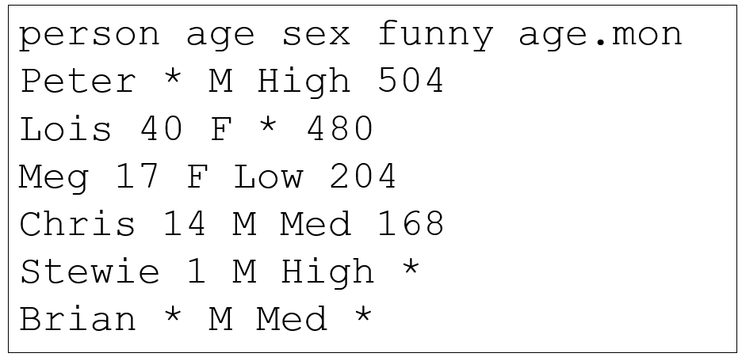

```{r rmarkdown-setup, echo = FALSE}
knitr::opts_chunk$set(warning = FALSE)
knitr::opts_chunk$set(message = FALSE)
```

## Day 2 Module 5

## Input, Output, and Functions

### Bundled Datasets

- data() displays data bundled with the R distribution

```{r}
data()
```

### Viewing Dataset Information

- ?dataset will display information about or a particular dataset

```{r}
?CO2
```

- Bundled data can be extracted using the same tools and methods used for analysis in previous modules

```{r}
??Chickweight    # ?? does a more in-depth search than ?
ChickWeight[1:15,]
```

- File Input and Output

- R provides many functions to read and write file data
  - Table-format data is structured as plain-text files
  - formatting options required when processing:
    - a header row (optional), used for column names
    - a delimiter, used to separate data items in each row
    - missing value character(s), used in place of missing data items
- Typical file extension is .txt (text) or .csv (comma-separated values)

- The file mydatafile.txt contains the following data, including a header row, single-space delimiter, and '*' characters for missing data



- read.table() reads a text file in as a data frame
  - Use stringsAsFactors=F to prevent conversion to factors
  - Use skip=n to skip n lines before beginning to read

```{r}
mydatafile <- read.table('mydatafile.txt', 
                           header=T, sep=' ', 
                           na.string='*')
mydatafile
```
