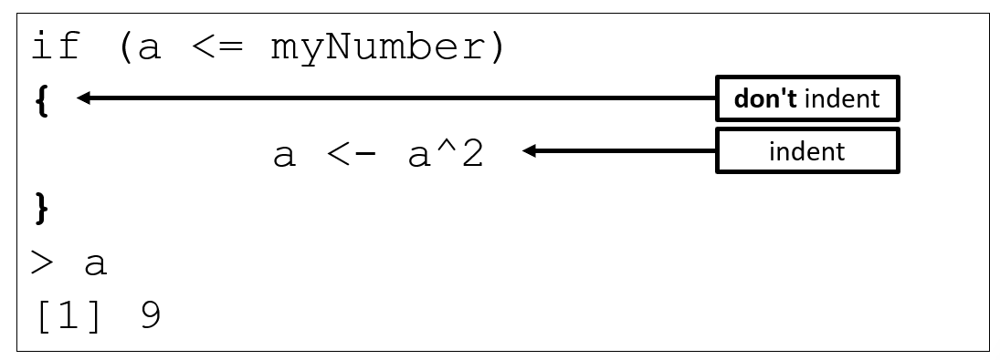

```{r rmarkdown-setup, echo = FALSE}
knitr::opts_chunk$set(warning = FALSE)
knitr::opts_chunk$set(message = FALSE)
```

## Day 2 Module 6

### Conditions and Loops

- The **if** statement allows for conditional execution of code

```{r}
a <- 3
myNumber <- 4
if (a <= myNumber) {   # end of line brace style
         a <- a^2
         print('modifying a')
}

if (a <= myNumber) 
{   # next line brace style
         a <- a^2
         print('modifying a')
}
```

-- end of line or next line brace style is acceptable but be consistent



- For a single-line if statement body, braces are not required, but it doesn't hurt to use them anyway
  - Using them can prevent subsequent defects when code is added to the body later
  
```{r}
a <- 3
myNumber <- 4
if (a <= myNumber) # this works
     a <- a^2

if (a <= myNumber) { # but this is recommended
     a <- a^2
}
```

