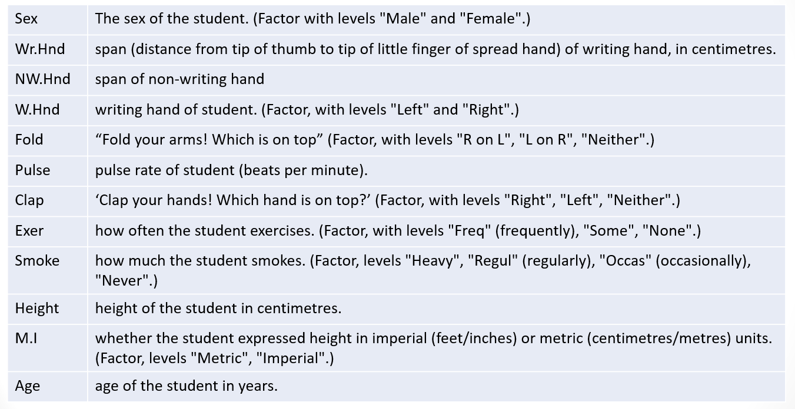

```{r rmarkdown-setup, echo = FALSE}
knitr::opts_chunk$set(warning = FALSE)
knitr::opts_chunk$set(message = FALSE)
```

## Day 3 Module 9

## Advanced Statistics in R: Regression

### Simple Linear Regression

-0 Linear regression explains the relationship between a dependent variable and one or more independent variables
  - Other names for the dependent variable: outcome variable, response variable
  - Other names for the independent variable: predictor variable, explanatory variable
  - An example follows which uses the Rbase MASS dataset

```{r}
library(MASS)
? survey
```

### MASS Survey DataFormat


- Plot student height vs. writing-hand handspan
  - Note the use of formula notation ~ 
  - "height is a function of handspan"
    - or 
  - "height on handspan"
- Clustering indicates a positive linear relationship

```{r}
plot(survey$Height ~ survey$Wr.Hnd,
     xlab="Writing handspan (cm)",
     ylab="Height (cm)")
```

- The dataset contains some missing values, we can use which(is.na …) to find them

```{r}
which(is.na(survey$Height) | is.na(survey$Wr.Hnd))
incomplete.obs <- which(is.na(survey$Height)|is.na(survey$Wr.Hnd))
length(incomplete.obs)
```

### Correlation Coefficient

- Calculate the correlation coefficient using cor( ) function to assess strength of the relationship
  - Range of coefficient values is -1 to +1, where -1 is a perfect negative correlation and +1 is a perfect positive correlation
    - "use" parameter indicates method for dealing with missing values; "complete.obs" means missing values are handled by casewise deletion (and if there are no complete cases, that gives an error)

```{r}
cor(survey$Wr.Hnd,survey$Height,use="complete.obs")
```
